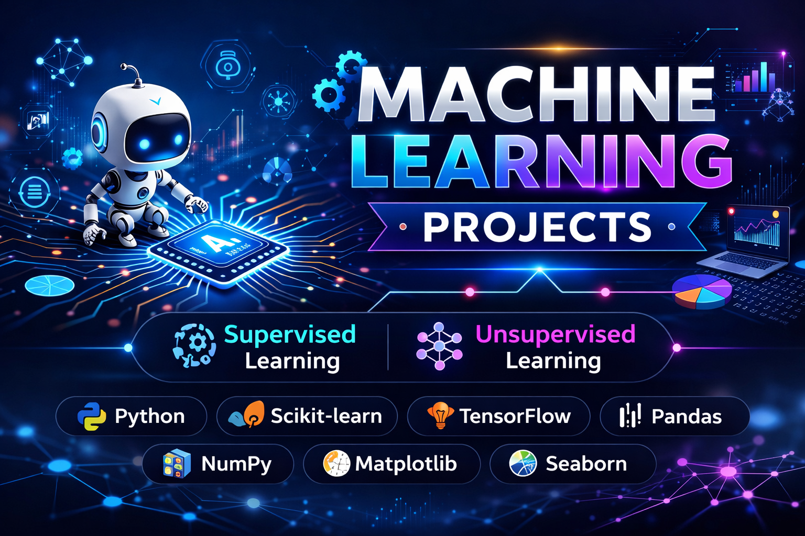

# **🤖 Machine Learning Projects**

# **📌 Description**

This repository contains a collection of Machine Learning projects organized into two main folders: Supervised Learning and Unsupervised Learning. The projects demonstrate practical implementation of machine learning algorithms to solve real-world data problems such as prediction, classification, clustering, and pattern discovery.

The repository showcases end-to-end machine learning workflows, including data preprocessing, feature engineering, model training, evaluation, and visualization using Python and popular machine learning libraries.
   
# **🚀 Key Features**

✨ Supervised and Unsupervised Machine Learning models

📊 Data preprocessing and feature engineering

🤖 Model training and evaluation

📈 Data visualization and insights

⚙️ Hyperparameter tuning

🧪 Real-world datasets
